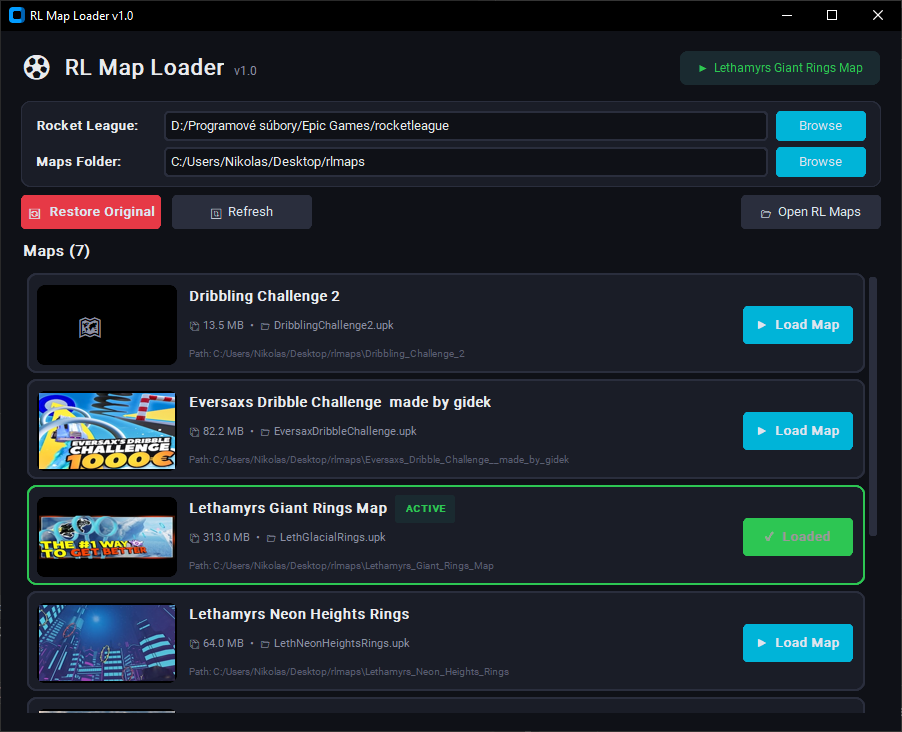

# ⚽ RL Map Loader

A lightweight app for loading custom training maps into Rocket League.

Works alongside Easy Anti-Cheat — only swaps an offline map file (asset swap), no code injection or memory modification.



---

## Download

### Option 1: Standalone .exe (recommended)
Go to [**Releases**](../../releases/latest) and download `RLMapLoader.exe`. No installation or Python needed — just run it.

### Option 2: Run from source
Requires [Python 3.9+](https://www.python.org/downloads/) (check "Add Python to PATH" during install).

Double-click `LAUNCH.bat`, or manually:
```
pip install customtkinter Pillow
python rl_map_loader.py
```

---

## How It Works

1. The app backs up the original `Labs_Underpass_P.upk` (Underpass) map
2. Copies your custom map in place of the original
3. In Rocket League, launch Freeplay/Exhibition on **Underpass** — your custom map loads
4. When you're done, click **Restore Original** and everything is back to normal

---

## Setup Guide

When you first open the app, you need to set two paths: your **Rocket League install folder** and your **custom maps folder**.

### Finding your Rocket League folder

#### Epic Games
Your Rocket League folder is wherever you chose to install it through the Epic Games Launcher. The default location is:
```
C:\Program Files\Epic Games\rocketleague
```
If you installed it on a different drive or custom path, it might look something like:
```
D:\Epic Games\rocketleague
```

**How to find it:** Open Epic Games Launcher → click the **three dots** next to Rocket League → **Manage** → look for the **Installation** path shown at the top.

#### Steam
The default Steam location is:
```
C:\Program Files (x86)\Steam\steamapps\common\rocketleague
```

**How to find it:** Open Steam → right-click **Rocket League** in your library → **Properties** → **Installed Files** → **Browse**.

#### How do I know I picked the right folder?
After selecting the folder, the app automatically looks for the subfolder `TAGame\CookedPCConsole` inside it. If you see your maps load and the **Load Map** button works without errors, you're good. If you get an error saying `Labs_Underpass_P.upk` was not found, double-check that you selected the `rocketleague` folder (not a parent or child folder).

### Setting up your custom maps folder

Create a folder anywhere on your computer (e.g. `C:\Users\YourName\Desktop\rlmaps`) and put your downloaded custom maps inside. Each map should be in **its own subfolder** containing a `.upk` file. See the Maps Folder Structure section below for details.

You can download custom maps from sites like [Lethamyr's website](https://lethamyr.com/maps) or the Rocket League custom maps community.

---

## Maps Folder Structure

Point the app at a folder containing your custom maps. Each map should be in its own subfolder with a `.upk` file:

```
rlmaps/
├── Dribbling_Challenge_2/
│   ├── DribblingChallenge2.upk        ← map file (required)
│   ├── Dribbling_Challenge_2.jfif     ← thumbnail (optional)
│   └── ...
├── Rings_Map/
│   ├── RingsMap.upk
│   └── Rings_Map.jpg
└── Speed_Jump/
    └── SpeedJump.upk
```

Thumbnails (`.jfif`, `.jpg`, `.png`) are optional — if missing, a placeholder is shown.

---

## Tips

- If you get a permission error, run the app **as Administrator** (right-click → Run as administrator)
- Make sure **Rocket League is not running** before loading a map (some files may be locked)
- Settings are saved automatically in `rl_map_loader_config.json`

---

## Anti-Cheat Safety

This app **does NOT**:
- ❌ Modify any .exe files
- ❌ Touch game process memory
- ❌ Inject any DLLs
- ❌ Alter online behavior

This app **only**:
- ✅ Copies a map file (.upk) on disk
- ✅ Backs up and restores the original map
- ✅ Works offline only (Exhibition/Freeplay)

---

## Building the .exe yourself

If you want to build the executable from source:

1. Make sure Python is installed
2. Double-click `BUILD.bat`
3. The `.exe` will be at `dist/RLMapLoader.exe`

Or manually:
```
pip install pyinstaller customtkinter Pillow
pyinstaller --onefile --windowed --name RLMapLoader --collect-data customtkinter --hidden-import PIL rl_map_loader.py
```

---

## License

MIT — free to use, modify, and share.
